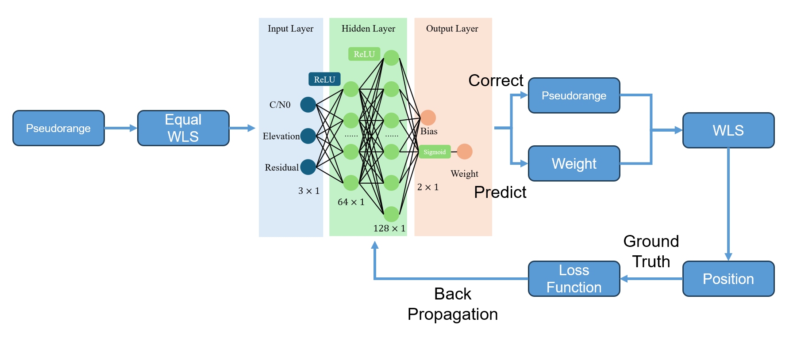
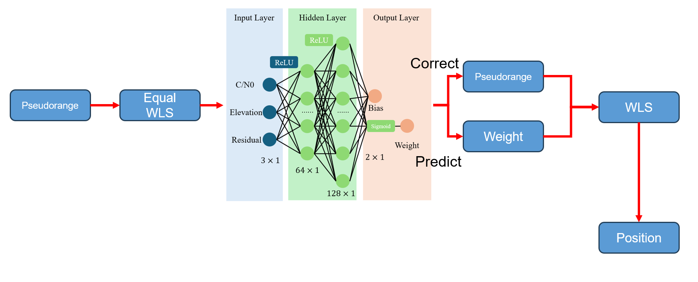

# TDL-GNSS

## News

2025.09.15
Our paper has been successfully published in *IEEE Transactions on Intelligent Transportation Systems*! To celebrate, we have released a major update that completely refactors the codebase. We built a common base library called [TASGNSS](https://github.com/PolyU-TASLAB/TASGNSS), which implements several useful GNSS functions. TDL-GNSS has been rebuilt using this package, and training speed is now **ten times (10x) faster** than before, thanks to a new caching mechanism. Additionally, we have adapted support for the KLT Dataset and user-built datasets. The older version is now **deprecated** — please update to the latest version. Don’t forget to cite our paper:

```latex
@ARTICLE{10965937,
  author={Hu, Runzhi and Xu, Penghui and Zhong, Yihan and Wen, Weisong},
  journal={IEEE Transactions on Intelligent Transportation Systems}, 
  title={pyrtklib: An Open-Source Package for Tightly Coupled Deep Learning and GNSS Integration for Positioning in Urban Canyons}, 
  year={2025},
  volume={26},
  number={7},
  pages={10652-10662},
  keywords={Global navigation satellite system;Deep learning;Python;Artificial intelligence;Weight measurement;Satellites;Receivers;Mathematical models;Training;Position measurement;Artificial intelligence;deep learning;GNSS;RTKLIB},
  doi={10.1109/TITS.2025.3552691}}
```

2024.10.25
New dataset available! We opensource the complete KLT dataset with LOS/NLOS label and other sensor data. We want this dataset to be a benchmark for the deep learning aided tightly coupled GNSS. Please find and play at [KLTDataset](https://github.com/ebhrz/KLTDataset)

## Tightly Coupled Deep Learning and GNSS Integration Framework

This framework is built on [**pyrtklib**](https://github.com/IPNL-POLYU/pyrtklib) and [**TASGNSS**](https://github.com/PolyU-TASLAB/TASGNSS), designed to tightly integrate deep learning into the GNSS (Global Navigation Satellite System) processing workflow. You can access the preprint version of our paper [on arXiv](https://arxiv.org/abs/2409.12996) and the published version [on IEEE Xplore](https://ieeexplore.ieee.org/abstract/document/10965937). We would greatly appreciate it if you cite our work:
```latex
@ARTICLE{10965937,
  author={Hu, Runzhi and Xu, Penghui and Zhong, Yihan and Wen, Weisong},
  journal={IEEE Transactions on Intelligent Transportation Systems}, 
  title={pyrtklib: An Open-Source Package for Tightly Coupled Deep Learning and GNSS Integration for Positioning in Urban Canyons}, 
  year={2025},
  volume={26},
  number={7},
  pages={10652-10662},
  keywords={Global navigation satellite system;Deep learning;Python;Artificial intelligence;Weight measurement;Satellites;Receivers;Mathematical models;Training;Position measurement;Artificial intelligence;deep learning;GNSS;RTKLIB},
  doi={10.1109/TITS.2025.3552691}}
```

### Features

The core functionality has been moved to [TASGNSS](https://github.com/PolyU-TASLAB/TASGNSS) — please refer to its documentation for details.

### Dataset

Now, we provide the whole dataset [KLTDataset](https://github.com/ebhrz/KLTDataset), which includes the previous content! Come and play!

---
~~We provide a dataset named **KLT**, which includes three subsets: **KLT1**, **KLT2**, and **KLT3**, divided by timestamp. Each subset includes 100Hz ground truth data generated by our ground truth collection platform. You can download the dataset from [Dropbox](https://www.dropbox.com/scl/fi/d3urwaquf5ema5j0unmt4/data.zip?rlkey=tuwpx9pdzqtdvoeoqwhcc5gi8&st=wh5qhg6e&dl=0). After downloading, extract the contents into a folder named `data`.~~

### Sensor Kit

For more details on the sensor kit we use, please refer to the [UrbanNav dataset](https://github.com/IPNL-POLYU/UrbanNavDataset). If you're interested in additional sensor data (e.g., camera, LiDAR, IMU) to build a multimodal architecture, you can download ROS bag files from [this Dropbox folder](https://www.dropbox.com/scl/fo/qbijzmzr2iorsirwb902p/ADZzlbG8SLhG94VvnFSwIgg?rlkey=mup7s7ot1yg0qhwygdp4cxztw&st=l9s3lc44&dl=0).

## Framework

### Training


**Note**: In the 2025-09-15 update, we added **azimuth** and **system one-hot encoding** as input features.

This diagram illustrates the training process. In this example, a simple network architecture takes **C/N0**, **elevation angle**, and **residuals** from an equal-weight least squares (WLS) solution as inputs. The network predicts pseudorange corrections and weights, which are fed back into the WLS solver to compute the final position.

The loss function is applied to the difference between the ground truth position and the predicted position, and this loss is backpropagated to train the network.

### Prediction


In the prediction process, just like during training, the output of the WLS is the final predicted position.


## Install
0. If you previously cloned an older version, we recommend removing it first:
```
rm -rf TDL-GNSS
```

1. Clone the repo.
```
git clone git@github.com:ebhrz/TDL-GNSS.git
```
2. Install the requirements.
```
pip install -r requirements.txt
```

## Usage

### For KLT Dataset:
You can link the KLT Dataset to the project folder using:
```
ln -s /path/to/your/KLTDataset ./KLTDataset
```
Then, use a configuration file to train and evaluate the model. Example configuration files are provided in the `config/` folder. The meaning of each field is explained in the **Configuration** section below. We use `config/train.json` and `config/test_klt1.json` as examples here.

### Preprocess

Now, we use a preprocess to handle all the data related to positioning, which means we will not calculate them over and over again in the training.
```
python3 preprocess config/train.json
python3 preprocess config/test_klt1.json
```
This will generate the preprocess.pkl files in the target folder.

### Train
Simply run:
```
python3 train.py config/train.json
```
This starts model training. Intermediate variables are cached, making training **10x faster** than the previous version.

### Evaluate
```
python3 evaluate.py config/test_klt1.json [model_path]
```
This runs evaluation. **Remember to run `preprocess` first for any new dataset.** The model path is optional — if omitted, the model specified in the config file will be used.

### *Baseline
We still provide a baseline from GoGPS.
```
python3 baseline.py config/test_klt1.json
```

### Configuration

#### DIY Dataset
We require the use of a configuration file to run the framework. For a custom dataset, the config should look like this:

```json
{
    "mode": "predict",
    "prefix": "data",
    "obs": [
        "whampoa_0521/UrbanNav-HK-Deep-Urban-1.ublox.f9p.obs",
        "whampoa_0521/hksc141g.21*"
    ],
    "gt": "whampoa_0521/gt.csv",
    "start_utc": 1621578528,
    "end_utc": 1621580061,
    "loss_type": "3d",
    "save_path": "result/whampoa_0521",
    "model_path": "result/0610klt3/model/2025-07-30_21_38/multinet_3d.pth",
    "device": "cpu",
    "batch": 50,
    "epoch": 80
}
```
This is an example for the Deep Urban Scenario from UrbanNav dataset.

- `mode`: Supports only `"predict"` or `"train"`. Used to validate the config file.

--`prefix`: The prefix of the data folder in the current directory. It will be the root for the next `obs` and `gt` parameters.

--`obs`: A list, including the observation file and ephemeris. The first one will be recognized as the user observation file, and the rest are the ephemeris.

- `gt`: The ground truth file corresponding to the observation file (one-to-one mapping). Format: `"timestamp,latitude,longitude,height,roll,pitch,yaw"`.

--`start_utc`: The wished start UTC time, in UNIX timestamp.

--`end_utc`: The wished end UTC time, in UNIX timestamp.

- `loss_type`: Either `"2d"` or `"3d"`. `"2d"` computes only horizontal positioning loss during training; `"3d"` includes vertical loss as well.

- `save_path`: The target folder for preprocessing, training, and evaluation outputs. All results will be saved here.

- `model_path`: Used only during evaluation. You can override this via the third command-line argument.

- `device`: Training device (default: `"cpu"`). Training is often faster on CPU because the process is logic-oriented rather than computation-intensive.

- `batch`: Not used in SPP training — you can ignore it.

- `epoch`: Number of training epochs. Typically, fewer than 100 epochs are sufficient for good generalization.

### KLT Dataset
We specifically adapted KLT Dataset. Because in KLT Dataset, there are already several meta config files. So to use KLT Dataset, you need a config file like this:
```json
{
    "mode": "train",
    "prefix": "KLTDataset",
    "datasets": [
        "KLTDataset/config/0610_klt3_404.json"
    ],
    "loss_type": "3d",
    "save_path": "result/0610klt3",
    "device": "cpu"
}
```
Unlike custom datasets, you don’t need to specify `obs` and `gt` files. Just ensure `prefix` contains `"KLT"`, and list your desired subdatasets under the `datasets` parameter. All other configuration fields remain the same.

~~Before training a network, you need to create a configuration file in JSON format. Below are the available parameters:~~
~~- `obs`: The RINEX observation file, either a single file name or a list of file names.~~
~~- `eph`: The ephemeris files, which can also be a single file name or a list of file names.~~
~~- `gt`: The ground truth file.~~
~~- `start_time`: An integer indicating the start time of the RINEX file, aligned to GPS time (in timestamp format).~~
~~- `end_time`: An integer indicating the end time of the RINEX file, aligned to GPS time (in timestamp format).~~
~~- `model`: The directory where the trained model will be saved.~~
~~- `mode`: Currently not used, but it may be implemented in the future for a unified interface.~~
~~- `epoch`: Used for training to specify the number of epochs.~~

~~Examples of configuration files can be found in the `config` folder.~~

## Training Tips
1. **Data Normalization**: All networks will first normalize the data, which means the model is tied to the specific receiver used during training. For example, if you collect data and train the model using a u-blox F9P receiver, the model may not perform well on data collected from a different device, such as a smartphone.

2. **Initial Position Guess**: Avoid setting the initial position guess to `(0, 0, 0)` during training — this can cause abrupt changes in the H matrix, adversely affecting gradients. A position derived from an equal-weight least squares solution is more stable and reasonable.

3. **Training Epochs for Hybrid Network**: When training a hybrid network (bias and weight combined), use fewer epochs compared to training bias-only or weight-only networks. Training for too many epochs can lead to overfitting. For the KLT3 dataset, we recommend around 100 training epochs.

4. **Windows Users**: If running on Windows, replace all forward slashes (`/`) with backslashes (`\\`) in the config file. For example:
   ```json
   {
      "obs":["data\\0610_KLT\\GEOP161D.21o"],
      "eph":"data\\0610_KLT\\sta\\hksc161d.21*",
   }
   ```

## Citation
If you find this tool useful, we would appreciate it if you cite our paper:
```latex
@ARTICLE{10965937,
  author={Hu, Runzhi and Xu, Penghui and Zhong, Yihan and Wen, Weisong},
  journal={IEEE Transactions on Intelligent Transportation Systems}, 
  title={pyrtklib: An Open-Source Package for Tightly Coupled Deep Learning and GNSS Integration for Positioning in Urban Canyons}, 
  year={2025},
  volume={26},
  number={7},
  pages={10652-10662},
  keywords={Global navigation satellite system;Deep learning;Python;Artificial intelligence;Weight measurement;Satellites;Receivers;Mathematical models;Training;Position measurement;Artificial intelligence;deep learning;GNSS;RTKLIB},
  doi={10.1109/TITS.2025.3552691}}
```
